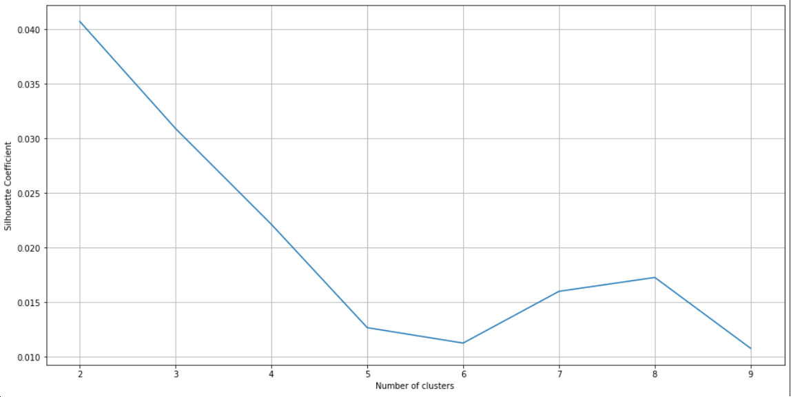
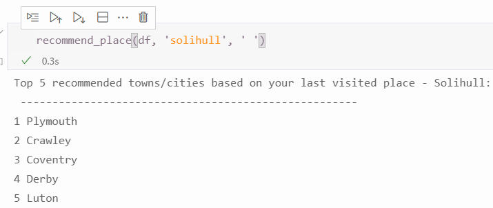
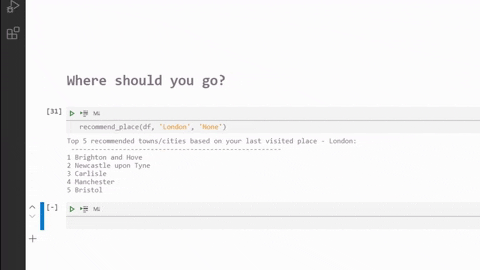
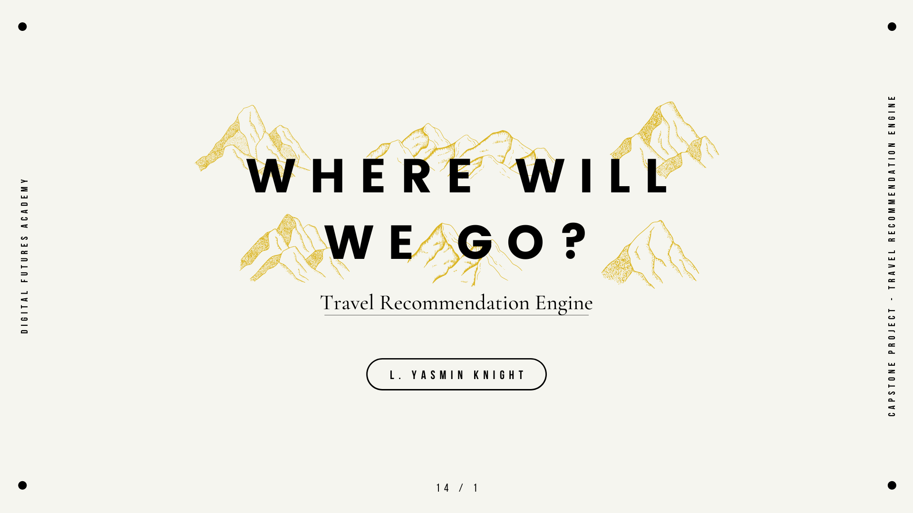

# Where will we go?

*A recommendation engine for travel in England, UK.*

## Context

For my capstone project in the Digital Futures Academy (Data Science stream), I worked on a recommendation engine. Tourism is an interest area of mine and I thought about making travel easier. Because of the pandemic, people have not been able to travel overseas easily so I wanted to create a way to pick travel destinations locally.

## Data

It was difficult to find a data set with information that I wanted and so I keyed this in manually. I took the list of cities in England from the National Statistics website and paired this with names, decriptions and ratings of 9 attractions. Attraction data was taken from the Google Travel website. Ultimately I only used the names and descriptions in the model as the other columns of data had a few problems.

### Issues with the data

- Some attractions did not have any ratings or reviews and it did not seem right to impute these
- The majority of the ratings were over 4 stars. For a simple recommendation engine, it was asier to not use these rather than find a way to incorporate them
- The tags were almost exactly the same for every city. There were 9 blanks and without knowing exactly how the tags were designated, I could not impute these.

## Preprocessing

### Original

- Created vital columns -> simple_id and keywords

### Updated

- Created stopwrds list
- Utilised TextBlob for nlp on keywords

## Model

### Original

The engine uses a similarity score to provide recommendations. It uses the attraction data for the place specified and compares it to the attraction data for all of the places in the data set. It then returns the 5 places most like the input as a recommendation.

### Updated

- Added more options for when no keyword is specified -> na, ' '
- Changed stop words in Count Vectorizer to list defined in Preprocessing

## Validation

K-means clustering was used to check that cities being returned as recommendations were being scored correctly. K-means was chosen for its simplicity.

The k-value chosen was 3. Despite the silhouette and inertia not showing any discernable kinks at 3, using clusters of 4 and 5 meant that a handful of citties were being separated into clusters and that was not desireable for this model.

Below are the results of one of the tests on the model.

Four of the cities returned in the results can be found in cluster 2 with Solihull. The exception being Conventry which is in cluster 0.

## The Engine at Work

## Going Further

Things that might make this engine even better:

- More data eg. more attractions for each city or ratings for each attraction or city
- Data from other parts of the United Kingdom (Scotland, Wales & Northern Ireland)
- Use of geo data so that distance can be used as a parameter
- Ability to indicate a country or keyword that should not be included in the results

## Capstone Presentation

You can view the original slide deck here: 
[Where will we go? Slide Deck](https://www.canva.com/design/DAEiPmroi70/OwbYTGj-oDw4gARrxZwC5A/view?utm_content=DAEiPmroi70&utm_campaign=designshare&utm_medium=link&utm_source=publishpresent "Where will we go? Slide Deck")

The original capstone presentation video can be found here:

